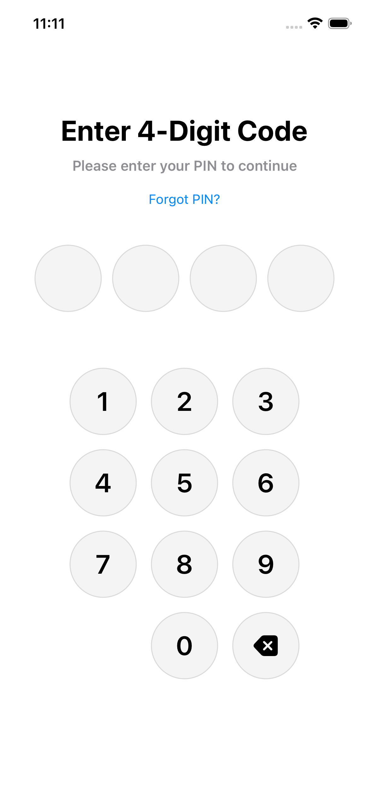
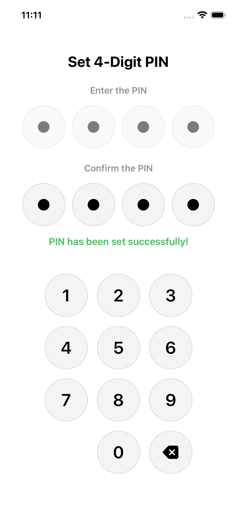
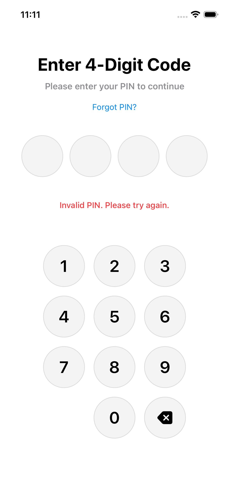
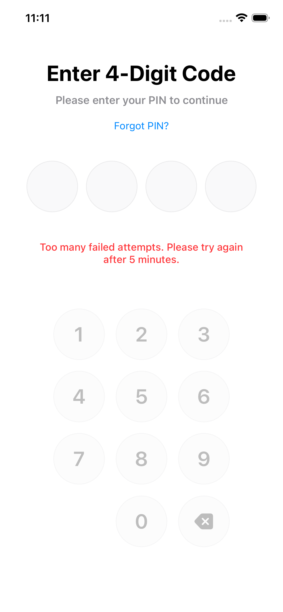

# KKPinView

A secure, customizable PIN entry and setup view for iOS and iPadOS built with SwiftUI. Features encrypted PIN storage, lockout protection, and a beautiful, modern UI.

[](https://swift.org)
[](https://developer.apple.com/ios/)
[](LICENSE)

## Features

- 🔐 **Secure PIN Storage**: AES-256-GCM encryption with device-specific keys
- 🛡️ **File Protection**: Uses `NSFileProtectionComplete` for encrypted storage
- 🔒 **Lockout Protection**: Automatic lockout after maximum failed attempts
- 🎨 **Modern UI**: Beautiful, customizable SwiftUI interface
- 📱 **iOS & iPadOS Support**: Optimized for both platforms
- ⚡ **Easy Integration**: Simple API with minimal setup required
- 🎯 **Two Views**: Separate views for PIN entry and PIN setup
- 🔄 **Auto-validation**: Automatic PIN validation with error handling

## Screenshots

### PIN Entry View
The main PIN entry screen for authenticating users.



### PIN Setup View
The PIN setup screen with entry and confirmation fields.



### Error State
Error message display when PIN is invalid.



### Lockout State
Lockout screen when maximum attempts are reached.



> **Note**: To add screenshots:
> 1. Create a `Screenshots` folder in your repository root
> 2. Add your screenshot images (PNG or JPG format recommended)
> 3. Update the image paths above to match your screenshot filenames
> 4. For best results, use screenshots with consistent dimensions (e.g., iPhone 14 Pro size: 1179x2556)

## Requirements

- iOS 15.0+ / iPadOS 15.0+
- Swift 6.2+
- Xcode 15.0+

## Installation

### Swift Package Manager

1. In Xcode, go to **File** → **Add Package Dependencies...**
2. Enter the repository URL:
   ```
   https://github.com/kamalkumar1/KKPinView_SwiftUI.git
   ```
3. Select the version rule (recommended: **Up to Next Major Version**)
4. Click **Add Package**

Alternatively, add the following to your `Package.swift`:

```swift
dependencies: [
    .package(url: "https://github.com/kamalkumar1/KKPinView_SwiftUI.git", from: "1.0.0")
]
```

## Quick Start

### 1. Import the Package

```swift
import SwiftUI
import KKPinView
```

### 2. PIN Setup (First Time)

Use `KKPINSetUPView` when the user needs to set up a new PIN:

```swift
struct SetupView: View {
    var body: some View {
        KKPINSetUPView(
            onSetupComplete: { pin in
                print("PIN setup completed!")
                // Navigate to main screen or authenticate
            }
        )
    }
}
```

### 3. PIN Entry (Authentication)

Use `KKPinViews` when the user needs to enter their PIN:

```swift
struct LoginView: View {
    var body: some View {
        KKPinViews(
            onForgotPin: {
                print("Forgot PIN tapped")
                // Handle forgot PIN flow
            },
            onSubmit: { isValid in
                if isValid {
                    print("PIN is valid - access granted")
                    // Navigate to authenticated screen
                } else {
                    print("PIN is invalid")
                    // Error is automatically displayed
                }
            },
            showForgotPin: true
        )
    }
}
```

## Usage Examples

### Complete Authentication Flow

```swift
import SwiftUI
import KKPinView

struct ContentView: View {
    @State private var isAuthenticated = false
    @State private var hasPIN = false
    
    var body: some View {
        Group {
            if !hasPIN {
                // Show PIN setup if no PIN exists
                KKPINSetUPView(
                    onSetupComplete: { pin in
                        hasPIN = true
                        isAuthenticated = true
                    }
                )
            } else if !isAuthenticated {
                // Show PIN entry for authentication
                KKPinViews(
                    onForgotPin: {
                        // Handle forgot PIN
                        hasPIN = false
                    },
                    onSubmit: { isValid in
                        if isValid {
                            isAuthenticated = true
                        }
                    }
                )
            } else {
                // Authenticated - show main content
                MainContentView()
            }
        }
        .onAppear {
            // Check if PIN exists
            hasPIN = KKPinStorage.hasStoredPIN()
        }
    }
}
```

### Customizing PIN Length

The default PIN length is 4 digits. To change it, modify `KKPinviewConstant.totalDigits`:

```swift
// In your app initialization or configuration
KKPinviewConstant.totalDigits = 6  // For 6-digit PIN
```

**Note**: This requires modifying the package source. For production use, consider making this configurable via initialization parameters.

### Handling Forgot PIN

```swift
KKPinViews(
    onForgotPin: {
        // Option 1: Delete PIN and show setup screen
        KKPinStorage.deletePIN()
        // Navigate to setup screen
        
        // Option 2: Show recovery options
        showRecoveryOptions = true
    },
    onSubmit: { isValid in
        // Handle authentication
    }
)
```

## API Documentation

### KKPinViews

Main PIN entry view for authenticating users.

#### Initialization

```swift
KKPinViews(
    onForgotPin: (() -> Void)? = nil,
    onSubmit: ((Bool) -> Void)? = nil,
    showForgotPin: Bool = true
)
```

#### Parameters

- `onForgotPin`: Optional callback when "Forgot PIN?" is tapped
- `onSubmit`: Callback with validation result (`true` if PIN is valid, `false` otherwise)
- `showForgotPin`: Whether to show the "Forgot PIN?" button (default: `true`)

#### Behavior

- Automatically validates PIN when all digits are entered
- Displays error messages for invalid PINs
- Handles lockout automatically (disables input when locked out)
- Clears PIN fields after validation

---

### KKPINSetUPView

PIN setup view for creating a new PIN with confirmation.

#### Initialization

```swift
KKPINSetUPView(
    onSetupComplete: ((String) -> Void)? = nil
)
```

#### Parameters

- `onSetupComplete`: Optional callback when PIN setup is completed successfully. Receives the PIN string.

#### Behavior

- Two-step flow: Enter PIN → Confirm PIN
- Validates that both PINs match
- Automatically saves PIN when both match
- Clears previous PIN and lockout state before saving
- Displays success/error messages with animations

---

### KKPinStorage

High-level API for securely storing and retrieving PINs.

#### Methods

```swift
// Save a PIN
static func savePIN(_ pin: String) -> Bool

// Load stored PIN
static func loadPIN() -> String?

// Verify a PIN
static func verifyPIN(_ pin: String) -> Bool

// Check if PIN exists
static func hasStoredPIN() -> Bool

// Delete stored PIN
static func deletePIN()
```

#### Example

```swift
// Save PIN
if KKPinStorage.savePIN("1234") {
    print("PIN saved successfully")
}

// Verify PIN
if KKPinStorage.verifyPIN("1234") {
    print("PIN is correct")
}

// Check if PIN exists
if KKPinStorage.hasStoredPIN() {
    // Show PIN entry screen
} else {
    // Show PIN setup screen
}
```

---

### KKPinLockoutManager

Manages PIN validation attempts and lockout logic.

#### Initialization

```swift
let manager = KKPinLockoutManager(
    maxAttempts: 5,              // Default: 5
    lockoutDurationMinutes: 5     // Default: 5 minutes
)
```

#### Properties

- `failedAttempts: Int` - Current number of failed attempts
- `maxAttempts: Int` - Maximum allowed attempts
- `isLockedOut: Bool` - Whether currently locked out
- `remainingLockoutMinutes: Int` - Remaining lockout time
- `hasReachedMaxAttempts: Bool` - Whether max attempts reached

#### Methods

```swift
// Validate PIN (handles attempt tracking)
func validatePIN(_ pin: String) -> Bool

// Reset failed attempts
func resetFailedAttempts()

// Check lockout status
func checkLockoutStatus()

// Get error message
func getErrorMessage() -> String?
```

#### Example

```swift
let manager = KKPinLockoutManager()

if manager.isLockedOut {
    print("Locked out for \(manager.remainingLockoutMinutes) minutes")
}

if manager.validatePIN("1234") {
    print("PIN is valid")
} else {
    if let error = manager.getErrorMessage() {
        print(error)
    }
}
```

## Security Features

### Encryption

- **Algorithm**: AES-256-GCM (Galois/Counter Mode)
- **Key Derivation**: PBKDF2-HMAC-SHA256 with device-specific salt
- **Key Storage**: Secure keychain storage with device binding

### File Protection

- **Protection Type**: `NSFileProtectionComplete`
- **Access**: Files are only accessible when device is unlocked
- **Storage Location**: Application Support directory

### Lockout Protection

- **Default Max Attempts**: 5
- **Default Lockout Duration**: 5 minutes
- **Configurable**: Can be customized via `KKPinLockoutManager`

### Security Notes

- PINs are encrypted before storage
- Encryption keys are device-specific (cannot be transferred)
- Files are protected at the OS level
- Failed attempts are tracked and enforced
- Lockout state persists across app launches

## Customization

### Constants

Most UI elements can be customized via `KKPinviewConstant`:

```swift
// Colors
KKPinviewConstant.backgroundColor
KKPinviewConstant.textColor
KKPinviewConstant.errorTextColor
KKPinviewConstant.successTextColor

// Fonts
KKPinviewConstant.titleFontSize
KKPinviewConstant.subtitleFontSize

// Dimensions
KKPinviewConstant.totalDigits        // PIN length (4 or 6)
KKPinviewConstant.fieldHeight
KKPinviewConstant.fieldSpacing

// Strings
KKPinviewConstant.titleTextFormat
KKPinviewConstant.subtitleText
KKPinviewConstant.forgotPinText
```

### Lockout Configuration

```swift
// In KKPinviewConstant.swift
public static let maxPinAttempts: Int = 5
public static let pinLockoutDurationMinutes: Int = 5
```

## Architecture

```
KKPinView/
├── Views/
│   ├── KKPinViews.swift          # PIN entry view
│   ├── KKPINSetUPView.swift      # PIN setup view
│   ├── PinDigitField.swift       # Individual digit field
│   └── NumericKeypad.swift      # Custom keypad
├── Storage/
│   ├── KKPinStorage.swift        # High-level storage API
│   └── KeyGenerator/
│       ├── KKEncryptionHelper.swift      # AES-256-GCM encryption
│       ├── KKSecureKeyGenerator.swift   # Key generation
│       └── KKSecureKey.swift            # Key wrapper
├── Security/
│   └── KKPinLockoutManager.swift # Lockout management
└── Constants/
    └── KKPinviewConstant.swift   # Configuration constants
```

## Testing

The package includes comprehensive test coverage:

```bash
# Run tests
cd KKPinView
swift test

# Run tests with code coverage
swift test --enable-code-coverage
```

## Contributing

Contributions are welcome! Please feel free to submit a Pull Request.

## License

This project is licensed under the MIT License - see the [LICENSE](LICENSE) file for details.

## Support

For issues, questions, or feature requests, please open an issue on GitHub.

## Author

Created by kamalkumar

---

**Made with ❤️ using SwiftUI**
